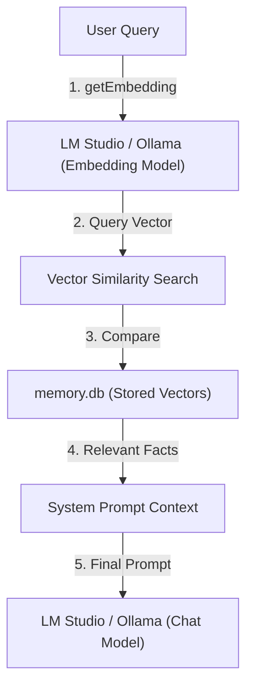

# Vector RAG Implementation Plan

## 1. Architectural Strategy
We will implement **Semantic Search** using Vector Embeddings. Instead of matching keywords, we will compare the "meaning" of sentences.
- **Embedding Source**: Use LM Studio or Ollama's `/embeddings` endpoint.
- **Isolation**: Add a specific setting for the "Embedding Model Name" so it doesn't conflict with the "Chat Model Name".
- **Storage**: Add a `vector` column (JSON or BLOB) to the existing `memories` table in `memory.db` to store the embedding arrays.
- **Search**: Use Cosine Similarity to compare the vector of the user's query with stored vectors.

## 2. Changes to `electron/services/settings.js` & UI
- Add `Embedding Model Name` to the default settings (e.g., `nomic-embed-text` or `text-embedding-3-small`).
- Add `Embedding Endpoint` (optional, defaults to the main endpoint).
- Update `AIBotDesktopUI.jsx` to include these new input fields in the Memory settings section.

## 3. Changes to `electron/services/llm.js`
- Create a new method `getEmbedding(text)` that calls the provider's embedding API.
- Ensure this call uses the `Embedding Model Name` specifically.
- Update `extractAndSaveMemory`: After extracting a fact, call `getEmbedding` and save the resulting vector into the database.

## 4. Changes to `electron/services/memory.js`
- **Database Migration**: Update `init()` to add a `vector` column to the `memories` table if it doesn't exist.
- **Vector Search Logic**: Implement a JavaScript-based Cosine Similarity function to rank memories by semantic closeness to the query vector.
- **Update `searchMulti`**: Instead of keyword matching, it will now:
    1. Get the embedding vector for the user's query.
    2. Calculate similarity against all stored vectors.
    3. Return the top N results above the `Min Memory Score`.

## 5. Implementation Steps
1. **Schema Update**: Add the vector column to SQLite.
2. **Embedding Integration**: Implement the API call to get vectors from LM Studio/Ollama.
3. **Migration Script**: (Optional) A way to generate vectors for existing memories.
4. **Search Overhaul**: Replace `LIKE` queries with Vector Similarity ranking.

## Todos
- [x] Add 'Embedding Model Name' and 'Embedding Endpoint' to settings and UI
- [x] Update `memories` table schema to include a `vector` column
- [x] Implement `getEmbedding` service in `llm.js`
- [x] Update `extractAndSaveMemory` to generate and store vectors for new memories
- [x] Implement Vector Similarity search in `memory.js` to replace keyword search
